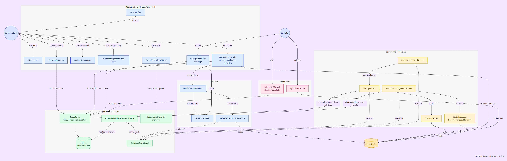

# Architecture

How the solution is laid out, what each project may depend on, and the naming
that makes a boundary violation visible. The rules here are enforced by
`tests/DlnaServer.ArchitectureTests`, not merely written down.

## How the pieces talk

The one process, as a renderer and an operator see it. Arrows point from the caller.

```mermaid
flowchart TB
    Renderer(("DLNA renderer"))
    Admin(("Operator"))

    subgraph Protocol["Media port - UPnP, SOAP and HTTP"]
        SsdpListener["SSDP listener"]
        SsdpNotifier["SSDP notifier"]
        ContentDirectory["ContentDirectory"]
        ConnectionManager["ConnectionManager"]
        AvTransport["AVTransport (accepts and logs)"]
        Events["EventController (GENA)"]
        FileServer["FileServerController<br/>media, thumbnails, subtitles"]
        Manage["ManageController<br/>/manage"]
    end

    subgraph Delivery["Delivery"]
        Resolver["MediaContentResolver"]
        Cache["ServedFileCache"]
        CacheFill["MediaCacheFillHostedService"]
    end

    subgraph AdminPort["Admin port"]
        AdminUi["Admin UI (Blazor)<br/>DlnaServer.Admin"]
        Upload["UploadController"]
    end

    subgraph Library["Library and processing"]
        Watcher["FileWatcherHostedService"]
        Indexer["LibraryIndexer"]
        Scanner["LibraryScanner"]
        Processing["MediaProcessingHostedService"]
        Processor["MediaProcessor<br/>ffprobe, ffmpeg, SkiaSharp"]
    end

    subgraph State["Persistence and state"]
        Repositories["Repositories<br/>files, directories, subtitles"]
        Db[("SQLite<br/>DlnaDbContext")]
        Initializer["DatabaseInitializerHostedService"]
        Ready["DatabaseReadySignal"]
        Subscriptions["SubscriptionStore (in memory)"]
    end

    Disc[("Media folders")]

    Renderer -- "M-SEARCH" --> SsdpListener
    SsdpNotifier -- "NOTIFY" --> Renderer
    Renderer -- "Browse, Search" --> ContentDirectory
    Renderer -- "GetProtocolInfo" --> ConnectionManager
    Renderer -- "SetAVTransportURI" --> AvTransport
    Renderer -- "SUBSCRIBE" --> Events
    Renderer -- "GET, HEAD" --> FileServer

    Admin -- "uses" --> AdminUi
    Admin -- "uploads" --> Upload
    Admin -- "scripts" --> Manage

    ContentDirectory -- "reads the index" --> Repositories
    Events -- "keeps subscriptions" --> Subscriptions
    FileServer -- "looks up the file" --> Repositories
    FileServer -- "resolves bytes" --> Resolver
    Resolver -- "memory first" --> Cache
    Resolver -- "queues a fill" --> CacheFill
    CacheFill -- "reads" --> Disc
    FileServer -- "streams from disc" --> Disc
    Manage -- "reads" --> Repositories
    Manage -- "clears" --> Cache

    AdminUi -- "reads and edits" --> Repositories
    Upload -- "writes files" --> Disc

    Watcher -- "reports changes" --> Indexer
    Indexer -- "walks" --> Scanner
    Scanner -- "reads" --> Disc
    Indexer -- "writes the index, links subtitles" --> Repositories
    Processing -- "claims pending, saves results" --> Repositories
    Processing -- "extracts" --> Processor
    Processor -- "reads" --> Disc

    Repositories --> Db
    Initializer -- "creates or migrates" --> Db
    Initializer -- "marks ready" --> Ready
    Indexer -. "waits for" .-> Ready
    Processing -. "waits for" .-> Ready
    CacheFill -. "waits for" .-> Ready
    Watcher -. "waits for" .-> Ready

    classDef actor fill:#dbe4ff,stroke:#3b5bdb,color:#1c2e7a
    classDef protocol fill:#dbeafe,stroke:#2563eb,color:#1e3a8a
    classDef admin fill:#ffe3ec,stroke:#d6336c,color:#8a1538
    classDef library fill:#fff3cd,stroke:#e0a100,color:#6b4200
    classDef state fill:#dcfce7,stroke:#16a34a,color:#14532d
    classDef disc fill:#ffe8b3,stroke:#e08e00,color:#6b4200
    class Renderer,Admin actor
    class SsdpListener,SsdpNotifier,ContentDirectory,ConnectionManager,AvTransport,Events,FileServer,Manage,Resolver,Cache,CacheFill protocol
    class AdminUi,Upload admin
    class Watcher,Indexer,Scanner,Processing,Processor library
    class Repositories,Db,Initializer,Ready,Subscriptions state
    class Disc disc
```

The same diagram as Mermaid - edit this, then re-render the picture

## Layout

| Project | Role |
| --- | --- |
| `src/DlnaServer.Core` | Domain model, DLNA types, configuration options, abstractions. No dependencies. |
| `src/DlnaServer.Persistence` | EF Core over SQLite: DbContext, entity configuration, migrations, repositories. |
| `src/DlnaServer.Media` | Library scanning, ffprobe metadata extraction, SkiaSharp thumbnails. |
| `src/DlnaServer.Upnp` | SSDP, `description.xml`, SCPD, SOAP services, DIDL-Lite. No EF, no HTTP. |
| `src/DlnaServer.Admin` | Blazor Server admin UI, as a Razor Class Library. Referenced by the Host as of M8; its components are served on the admin port only. |
| `src/DlnaServer.Host` | The ASP.NET Core host. The only executable; nothing references it. |
| `tests/DlnaServer.UnitTests` | NUnit + FluentAssertions. One type at a time, including the tests that pin the protocol bytes, plus the repository tests — those run against a throwaway on-disk SQLite database built by the real migrations (`SqliteTestDatabase`), because the in-memory provider does not enforce the collations, foreign keys and unique indexes they check. |
| `tests/DlnaServer.ArchitectureTests` | NetArchTest and reflection rules that fail the build rather than a review: the layering, the entity/DTO boundary, contract immutability, unique `[LoggerMessage]` EventIds, and the two-key rule on every entity. |
| `tests/DlnaServer.IntegrationTests` | Several real components wired together through DI — real persistence and SQLite, real temporary media folders — with fakes only where a test needs to control something awkward (the clock, options reload, a processor that throws). **No host is booted and nothing uses `WebApplicationFactory`**; the HTTP surface is covered by testing controllers and helpers directly. |

`DlnaServer.Upnp` depends on neither the database nor ASP.NET Core. That is deliberate: it turns plain inputs
into protocol strings, which is what makes byte-exact assertions possible without running a server.

Within those projects, a namespace holds one role rather than everything a folder happened to accumulate.
The folder path always mirrors the namespace:

| Namespace | Holds |
| --- | --- |
| `Core.Contracts` | The repository DTOs, and only those — this is the set the architecture tests hold immutable |
| `Core.Contracts.Scanning` / `.Watching` / `.Processing` | Parameter objects, filesystem events, and media-processing results |
| `Upnp.Soap` | `CustomEnvelopeMessage` alone |
| `Upnp.Soap.ContentDirectory` / `.AvTransport` / `.ConnectionManager` / `.MediaReceiverRegistrar` | One service interface plus that service's response contracts. Actions map 1:1 onto responses, so each namespace is exactly one SOAP endpoint's surface |
| `Host.Upnp.Control` / `.Discovery` | The SOAP service implementations and DIDL mapping, against SSDP advertisement and its two hosted services |
| `Host.Delivery.Caching` / `.Prefetch` | The served-bytes cache, against the backlog that fills it behind a response |
| `Media.Processing.Thumbnails` / `.Provisioning` | Image encoding, against ffmpeg provisioning |
| `Core.Uploads` / `Host.Uploads` | What may be uploaded and where it may land, against the endpoint plumbing that receives it - the split is what lets the admin page ask the same question the endpoint answers |

Moving a response contract between namespaces cannot change the wire, because every one of them pins its own
element name with `[XmlRoot]`/`[MessageContract]` — and `SoapContractWireNameTest` fails the build if a new
one forgets to, since that would silently make the CLR namespace part of the protocol.

`Media.Processing.Provisioning` is deliberately not called `.FFmpeg`: a namespace of that name shadows
Xabe's `FFmpeg` class, so `FFmpeg.GetMediaInfo(...)` stops compiling in every file under it.

## Class name suffixes

The suffix is a contract, not decoration: it says what the type is allowed to do and where it may live. A
type whose suffix does not match its behaviour is a defect, whichever half is wrong. One type per file,
interface and implementation in separate files, and the folder path mirrors the namespace.

| Suffix | What it is | What it must do — and must not |
| --- | --- | --- |
| `*Options` | Configuration bound from `config.json` (`DlnaOptions`, `ServerOptions`, `LibraryOptions`, `ThumbnailOptions`, `FileCacheOptions`, `DatabaseOptions`, `CompatibilityOptions`, `UploadOptions`) | Mutable properties with defaults and `DataAnnotations`; lives in `Core/Configuration`; read through `IOptionsMonitor<T>`, never captured in a field. No behaviour, no dependencies |
| `*Settings` | Options **resolved** for one operation and passed down a pipeline — `MediaProcessingSettings` | Immutable, built once from `*Options` and handed to every item in a pass, so the values cannot shift mid-batch under a config reload. Never bound to configuration itself: that is what separates it from `*Options`, and why it is not a `*Request` either — it outlives a single call |
| `*Dto` | A contract crossing a layer boundary | `sealed record`, `required`, `init`-only — the architecture tests fail the build on a settable property. Lives in `Core/Contracts`. What repositories project into and return |
| `*Entity` | An EF entity — `MediaFileEntity`, `MediaDirectoryEntity`, `ThumbnailEntity`, `ServerInstanceEntity`, `UploadDeviceEntity` | `internal` to `DlnaServer.Persistence`, deriving `EntityBase`; `int Id` internal plus `Guid PublicId` external. May never appear on a public signature. The suffix is what tells an entity from the `*Dto` that mirrors it, and it keeps a navigation property free to take the bare name — `MediaFileEntity.Thumbnail` is of type `ThumbnailEntity` |
| `*Configuration` | EF `IEntityTypeConfiguration<T>` | Named for the entity it configures, suffix included — `MediaFileEntityConfiguration` maps `MediaFileEntity`. One per entity, `internal` to persistence; only mapping — keys, indexes, converters, relationships, and an explicit `ToTable(...)` so the table name never depends on a CLR name |
| `*Repository` | The only way to reach the database | Takes and returns `PublicId` and DTOs, never entities; projects straight into DTOs (`is null` is a compile error in an expression tree — use `!= null`); async with a `CancellationToken` |
| `*HostedService` | A `BackgroundService` registered in `Program.cs` | Guards **per item** first and per pass second, so one bad file cannot end the loop. Resolves scoped services through `IServiceScopeFactory`, never by constructor injection |
| `*Service` | A UPnP SOAP control service — `ContentDirectoryService`, `ConnectionManagerService`, `AvTransportService`, `MediaReceiverRegistrarService` | Reserved for the four SOAP endpoints. **Not** a general-purpose "business service" suffix; operation parameters are PascalCase, deliberately, because SoapCore binds them by element name |
| `*Controller` | An MVC controller | Explicit binding attributes, inline route constraints (`{id:guid}`), and one port via `AdminOrMediaPortEndpointFilter`, which classifies by path prefix - `RequirePortEndpointFilter` now guards only the two health endpoints. Thin: no domain logic |
| `*Response` | A SOAP response contract, one per action | `sealed class` with `[MessageContract]`/`[XmlRoot]` pinning the wire name, and every property documenting what it becomes on the wire |
| `*Result` | The outcome of an operation, success or failure | An immutable record carrying enough for the caller to decide; no exceptions for expected outcomes |
| `*Request` | A parameter object for one call — `BrowseRequest`, `LibraryScanRequest`, `ThumbnailRequest` | Immutable; groups arguments that travel together. Not `*Options`: nothing here is bound from configuration |
| `*Builder` | Turns inputs into a protocol document — `DeviceDescriptionBuilder`, `SsdpMessageBuilder` | Pure and static where possible: inputs to string, no I/O, so the bytes can be asserted |
| `*Mapper` | Translates between layers — `DidlMapper` | Pure functions only. No I/O, no repository calls |
| `*Serializer` | Writes a type to its wire form — `DidlSerializer` | Deterministic bytes; anything it emits is golden-file tested |
| `*Interceptor` | An EF Core interceptor | Observes commands; never changes results |
| `*Converter` | An EF value converter | Pure and lossless in both directions |
| `*Provider` | Supplies a value that cannot be a constant — `LocalAddressProvider` | Read-only; the value may change between calls |
| `*Scanner` / `*Indexer` / `*Watcher` | Discovers files, reconciles them into the index, reacts to filesystem events | Scanner reads the filesystem only; indexer owns the reconciliation; watcher only reports |
| `*Processor` / `*Generator` / `*Provisioner` | Media work: metadata extraction, thumbnail encoding, ffmpeg provisioning | Returns `null` for "could not", never throws for bad input — they are fed arbitrary user files |
| `*Cache` / `*Store` / `*Registry` / `*Backlog` | Holds state for longer than a request | Registered as a singleton; bound by real bytes where it holds payloads; thread-safe |
| `*Validator` / `*Guard` / `*Defaults` | Startup correctness — refuse to boot, recover a broken file, fill a blank setting | Run in that order: defaults, then validation. Failure messages name the setting and what to do |
| `*Middleware` / `*Filter` / `*Attribute` | ASP.NET pipeline pieces | `Host` only; no domain logic |
| `*Extensions` | Extension methods, in a `static` class | Pure and deterministic only. Anything touching I/O, time or DI belongs on an injectable type instead |
| `*Catalog` | One lookup table — `DlnaMimeCatalog` | Static and immutable; the single source for that mapping |
| `*.Log.cs` | The `[LoggerMessage]` partial beside its type | Same folder and namespace as `Foo.cs`; unique `EventId` per class; the declared level must match what the doc comment claims |
| `*Test` | A test fixture, named for its subject | `internal sealed`, `[TestFixture]`, Arrange/Act/Assert, and every assertion carries a `because` reason |

**`*Options` now means one thing only: bound from `config.json`.** The two parameter objects that used to
wear it are `BrowseRequest` and `LibraryScanRequest`, and the stream entities have dropped their redundant
`Info` — `AudioStreamEntity` rather than `AudioStreamInfoEntity`, since `*Entity` already says what the
type is. `DlnaMimeInfo` keeps `*Info` legitimately: it is a plain value, not an entity.

## One library, whether it is a television or the admin UI asking

Every **listing** the repositories answer - source roots, a folder's children, recently added, and both
searches - hides the same two things, and there is no flag to ask for more:

- anything whose path matches an entry in `Library.ExcludeFolders`, and
- any folder whose subtree holds no visible file.

So the admin pages and a renderer cannot disagree about what the library holds. The second rule is what
keeps QNAP's own `.streams` and `.@upload_cache` off a television, and it also covers the folder left empty
by hiding the only child that held media - which takes effect on the next request, with no rescan.

Two things are deliberately **not** filtered. Lookup by identifier or by path still returns hidden content,
so a renderer mid-stream is not cut off and a hidden file's page still opens from a link someone already
has. And the indexer's own reads are never filtered: `GetExistingPathsAsync` decides what to insert, so
hiding an indexed row from it would make the next scan re-insert the path and violate the unique index -
and `GetIndexedPageAsync` decides what to delete, so filtering it would strand a hidden file's row after
its file was deleted from disc.

`ILibraryScanner.EnumerateDirectories` yields only the folders that lead to media - each folder holding an
indexable file, plus its ancestors up to the source root, which is always yielded. An indexed folder the
scan no longer offers is therefore removed by reconciliation, and because the same set decides insertion,
nothing is pruned on one pass and re-added by the next. A folder `ExcludeFolders` hides is exempt from that
removal: hiding is meant to retire a folder without discarding its rows, so adding a name to that setting
never costs the subtree's metadata and thumbnails.
